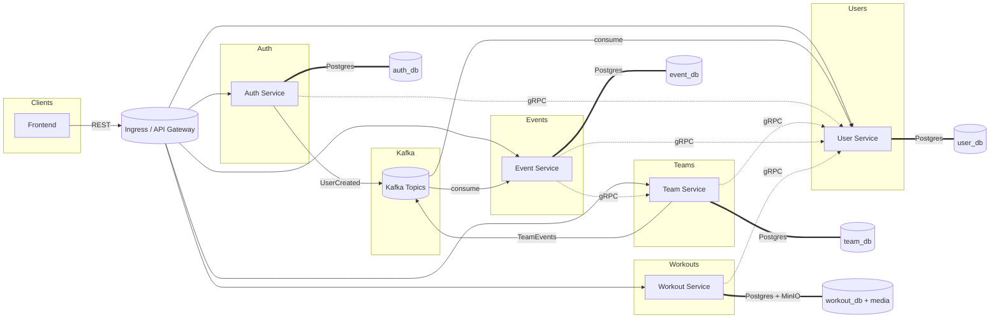

# Sports Management Platform (Backend)

Modern microservices backend in Go for authentication, teams, events, workouts, and shared packages. This README explains the architecture, service roles, communication patterns, and key design decisions. A Mermaid diagram is provided for quick visualization.

## System Architecture

- **Microservices**: Independently deployable, each owns its data and business logic.
- **Synchronous gRPC**: Low-latency service-to-service calls for validation/reads.
- **Asynchronous Kafka**: Event-driven choreography to decouple services and improve resilience.
- **Data per Service**: Each service owns its Postgres schema; no cross-service DB writes.
- **API Exposure**: REST for external clients; gRPC for internal calls.
- **Container/K8s**: Docker images built per service; deployed to Kubernetes via CI/CD.

### Mermaid Diagram (paste into Markdown viewer)

## Services and Responsibilities

### Auth Service
- **Purpose**: Registration, login, JWT issuance (access/refresh), role claims, and publishing `UserCreated` events.
- **Stores**: Users, roles, user_roles.
- **Sync**: gRPC token/claims verification (middleware use).
- **Async**: Publishes `UserCreated` to Kafka for profile creation.

### User Service
- **Purpose**: Owns user profiles (name/email/metadata). Source of truth for user identity data consumed by other services.
- **Stores**: Profiles table.
- **Sync**: gRPC to serve profile data to team, event, workout services.
- **Async**: Consumes `UserCreated` to auto-create profiles.

### Team Service
- **Purpose**: Teams, rosters, member roles (coach/manager/player), and roster queries.
- **Stores**: Teams and team_members tables.
- **Sync**: gRPC to user-service for member validation; gRPC server for roster/role checks.
- **Async**: Publishes team events to Kafka (e.g., roster changes) for downstream consumers (event-service).

### Event Service
- **Purpose**: Team events (games/practices), scheduling, attendance.
- **Stores**: Events and attendance tables.
- **Sync**: gRPC to team-service (authorize team context) and user-service (attendee details).
- **Async**: Consumes team events as needed for denormalized views.

### Workout Service
- **Purpose**: Workouts, exercises, media metadata; presigned uploads to MinIO.
- **Stores**: Workouts, exercises, workout_exercises, media tables; assets in MinIO.
- **Sync**: gRPC to user-service for ownership/identity checks.
- **Async**: None today (could emit media or workout events later).

### Shared Packages
- `sports-common-package`: Shared middleware (JWT claims), gRPC stubs, and cross-cutting helpers.
- `sports-proto`: Proto definitions for gRPC services.

## Communication Patterns

- **gRPC (sync)**: Used for read/validate flows needing immediate response (e.g., team→user: ensure member exists before add; event→team: ensure requester is coach).
- **Kafka (async)**: Used for decoupling creation/update flows (e.g., auth emits `UserCreated`, user-service consumes later; team emits roster events, event-service ingests for attendance views). Improves resilience to partial outages and allows replay.
- **REST**: External clients interact through HTTP/JSON; internal calls prefer gRPC.

## Design Decisions & Trade-offs

- **Service-per-domain**: Clear ownership (auth/user/team/event/workout). Avoids shared databases and reduces coupling. Trade-off: more deployment and ops overhead.
- **gRPC for internal calls**: Chosen for performance and strong contracts. Trade-off: additional proto/tooling maintenance versus simpler REST.
- **Kafka for events**: Chosen to decouple services and allow replay. Trade-off: operational complexity (brokers, topics, monitoring) and eventual consistency for consumers.
- **Postgres per service**: Ensures autonomy and independent scaling. Trade-off: cross-entity queries need APIs instead of JOINs.
- **JWT-based auth**: Stateless, fast checks at edges; roles embedded in claims. Trade-off: revocation/blacklist requires extra mechanism (future work).
- **MinIO for media**: S3-compatible and self-hostable for workout assets. Trade-off: manage object storage availability and lifecycle.
- **Kubernetes deploy**: Standardized CI/CD (lint → test → build image → push → kubectl apply). Trade-off: cluster ops overhead vs. simplicity of single VM.

## CI/CD Overview

1. **Lint**: golangci-lint per service.
2. **Test**: `go test ./...` per service; sqlmock-based unit tests for auth; handlers to be expanded.
3. **Build & Push**: Docker Buildx, tags `latest` and commit SHA.
4. **Deploy**: kubectl apply manifests in `k8s/`; uses secrets for kubeconfig and Docker Hub.

## Local Development

- `docker-compose up` (for local stack: Postgres, Kafka, MinIO, services) — adjust as needed.
- Per-service run: `go run ./cmd/main.go` after setting `.env`.
- Lint: `golangci-lint run ./...`
- Test: `go test ./...`

## Future Work

- Add finance/billing service (subscriptions, team billing).
- Expand handler tests across all services.
- Token revocation/blacklist and rate limiting on auth endpoints.
- Event sourcing or outbox pattern for stronger delivery guarantees.
- Observability stack (metrics/logs/traces) standardized across services.